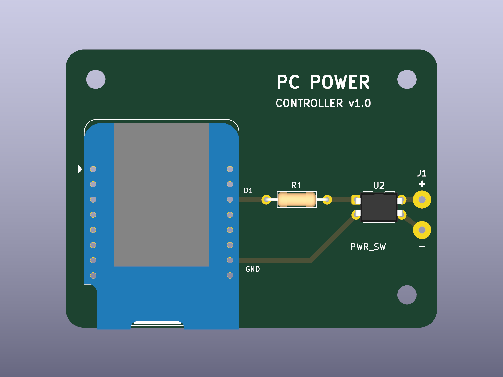

# 🔧 Hardware — carte optocoupleur (KiCad)

PCB « carrier » pour le contrôleur d'alimentation : un **Wemos D1 Mini** pilote
un **PC817** à travers **R1 (330 Ω)** ; la sortie de l'optocoupleur va sur
**2 pastilles à souder** (J1) reliées par fils au header `PWR_SW` de la carte
mère. Isolation galvanique totale entre l'ESP8266 et le PC.



## Contenu

| Fichier | Rôle |
|---|---|
| `pc-power-controller.kicad_pro/sch/pcb` | Projet KiCad (s'ouvre dans KiCad ≥ 9) |
| `pc_power.kicad_sym`, `pc_power.pretty/` | Symboles & empreintes du projet (copies figées des libs officielles 9.0.9.1) |
| `generate/gen_sch.py` | Génère le schéma (Python pur) |
| `generate/gen_pcb.py` | Génère le PCB routé (API `pcbnew` du flatpak KiCad) |
| `fab/` | Sorties : Gerbers + perçage (`pc-power-controller-gerbers.zip`), BOM, rendus, rapports ERC/DRC |

## Nomenclature (BOM)

| Réf. | Composant | Empreinte |
|---|---|---|
| U1 | Wemos D1 Mini (ESP8266) | 2 rangées de 8 broches, pas 2,54 mm — prévoir des **headers femelles** |
| U2 | PC817 (Sharp) | DIP-4 |
| R1 | Résistance 330 Ω, 1/4 W axiale | DIN0207, pas 10,16 mm |
| J1 | — | 2 pastilles Ø3 mm, perçage 1,2 mm, pas 5,08 mm |
| H1-H3 | Vis M3 | 3 trous de fixation Ø3,2 mm |

## Câblage vers le PC

- Pastille **`+`** → broche `PWR_SW` (signal) du header F_PANEL de la carte mère
- Pastille **`−`** → broche `GND` du même header
- La polarité **compte** (collecteur/émetteur du PC817). En cas de doute : la
  broche `+` du header carte mère est celle qui n'est pas au GND du boîtier.
- Le module s'alimente par son **port USB** (bord bas de la carte).

## Régénérer les fichiers

```bash
cd hardware
python3 generate/gen_sch.py
flatpak run --command=python3 org.kicad.KiCad generate/gen_pcb.py
```

## Vérifier et exporter

```bash
k="flatpak run --command=kicad-cli org.kicad.KiCad"
$k sch erc --severity-all --format report -o fab/erc.rpt pc-power-controller.kicad_sch
$k pcb drc --schematic-parity --severity-all --format report -o fab/drc.rpt pc-power-controller.kicad_pcb
$k pcb render --side top -o fab/render-top.png pc-power-controller.kicad_pcb
$k pcb export gerbers --layers F.Cu,B.Cu,F.Mask,B.Mask,F.SilkS,B.SilkS,Edge.Cuts -o fab/gerbers/ pc-power-controller.kicad_pcb
$k pcb export drill --format excellon --excellon-units mm --drill-origin absolute -o fab/gerbers/ pc-power-controller.kicad_pcb
```

État actuel : **ERC 0 erreur / 0 warning, DRC 0 violation, parité schéma↔PCB OK.**

## Commander (ex. JLCPCB)

1. <https://jlcpcb.com> → *Order now* → uploader `fab/pc-power-controller-gerbers.zip`
2. Paramètres par défaut : 2 couches, 1,6 mm, HASL — carte 62 × 46,5 mm
3. ~2-5 € les 5 exemplaires, hors port. Soudure à la main (tout traversant).

## Notes de conception

- Piste GND : pad 10 du module (7ᵉ pastille, colonne droite) ; signal : pad 14
  (`D1`/GPIO5, 3ᵉ pastille) — cohérent avec `esp8266/src/main.cpp` (`pinOpto = D1`).
- La zone antenne du module (haut) est **sans cuivre ni piste** ; ne rien
  ajouter dans cette zone si la carte évolue.
- Prévu pour un 2ᵉ étage plus tard (lecture de l'état d'alim du PC) : les
  GPIO restants du module sont accessibles sur les pastilles du support.
